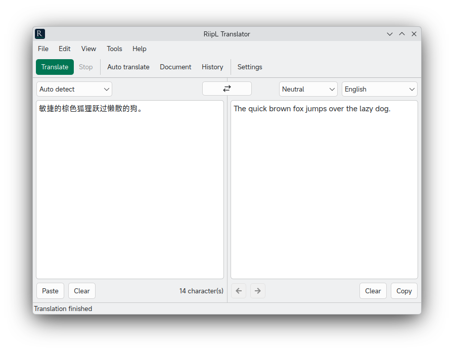

<div align="center">


# RiipL

**Local DeepL Rip-off.**


**English** | [中文](README.zh-CN.md)

[Introduction](#introduction) · [Features](#features) · [Installation](#installation) · [Build](#manual-build) · [Architecture](#architecture) · [Notes](#usage-notes)



</div>

## Introduction

RiipL is a cross-platform desktop translation app. It plugs into **any OpenAI-compatible API** to serve as its translation engine, relying on no cloud translation service.

RiipL openly, shamelessly rips off and reimplements [DeepL](https://www.deepl.com)'s most features: translation notes, glossaries, wording alternatives, long-document translation and more. No more paying for an [expensive DeepL subscription](https://www.deepl.com/pro).

RiipL is built with C++ and Qt 6, and the compiled binary weighs in at only about **1MB**. Linux, macOS and Windows are supported.

The AI Agent under human supervision wrote the majority of RiipL's code.

## Features

What DeepL reserves for paying members, RiipL gives you completely free:

- 🔌 **Bring your own model** — works with OpenAI, Ollama, LM Studio, llama.cpp and any compatible gateway.
- 🧩 **Prompt template pipeline** — multiple customizable prompt templates: glossary, tone, style, background knowledge, personalization and more. Placeholder injection and live preview supported.
- 📖 **Glossary** — custom translations for your domain terms, with JSON import/export.
- 🗣 **Tones, styles & background** — 13 preset tones plus custom ones, with free-form style and background info.
- 📋 **Clipboard monitoring** — clipboard text is translated automatically, with copy-back of results.
- 🕘 **Translation history** — search and reuse past translations.

## Installation

### Linux (Arch based)

- Release branch:

  ```shell
  yay -S riipl
  ```

- Mainline branch:

  ```shell
  yay -S riipl-git
  ```

### Other Linux distros / macOS / Windows

See [Manual Build](#manual-build).

## Manual Build

### Prerequisites

| Dependency | Version |
| :- | :- |
| Qt 6 (Widgets, Network, LinguistTools) | 6.2+ |
| CMake | 3.21+ |
| C++ compiler | C++17 capable (GCC, Clang, MSVC) |

Debian / Ubuntu:

```bash
sudo apt install build-essential cmake qt6-base-dev qt6-tools-dev qt6-l10n-tools
```

Windows and macOS need a regular Qt 6 installation (online installer or `brew install qt cmake`); deploy with `windeployqt` / `macdeployqt` respectively.

### Compile

```bash
cmake -S . -B build -DCMAKE_BUILD_TYPE=Release
cmake --build build --clean-first -j$(nproc)
```

After a successful build the executable lives at `./build/RiipL`.

## Architecture

```text
RiipL/
├── resources/            # app icon, .qrc bundles, i18n .ts sources
├── src/
│   ├── core/             # framework-free logic (unit-tested)
│   │   ├── config/       # Defaults.h (default configuration) + ConfigManager (fallback store)
│   │   ├── network/      # ApiClient: SSE streaming, timeouts, error mapping
│   │   ├── translation/  # PromptBuilder, TranslationEngine, languages & tones
│   │   ├── models/       # Glossary
│   │   └── history/      # HistoryManager
│   ├── ui/               # MainWindow, bound editor widgets, dialogs
│   └── utils/            # JsonUtils, TextUtils, SingleInstance
└── tests/                # QTest suite for the core layer
```

## Usage Notes

- Translation quality and the stable operation of some features depend on the connected model.
- The API key is stored in plain text inside `config.json`; protect the file yourself if necessary.
