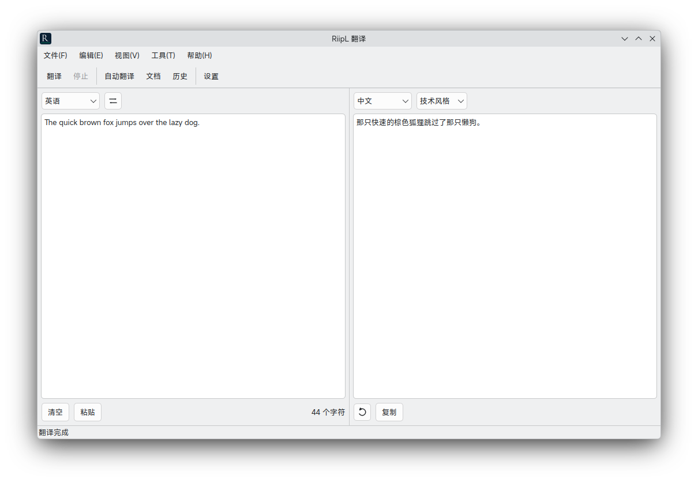

<div align="center">


# RiipL

**本地 DeepL 替代品。**


[English](README.md) | **中文**

[简介](#简介) · [功能](#功能) · [安装](#安装) · [构建](#手动构建) · [架构](#架构) · [须知](#使用须知)



</div>

## 简介

RiipL 是一款跨平台桌面翻译应用。通过**接入任意 OpenAI 兼容接口**来充当翻译引擎，不依赖任何云翻译服务。

RiipL 毫不掩饰、厚颜无耻地抄袭并实现了 [DeepL](https://www.deepl.com) 的大部分拳头功能: 翻译笔记、术语本、遣词替代、长文档翻译等。你不再需要订阅[昂贵的 DeepL 会员](https://www.deepl.com/pro)。

RiipL 使用 C++ 与 Qt 6 构建，编译后的程序大小仅约 **1MB**。支持 Linux、macOS 和 Windows。

人类监管下的 AI Agent 编写了 RiipL 的大部分代码。

## 功能

DeepL 仅向会员开放的功能，RiipL 完全免费：

- 🔌 **自带模型**：支持 OpenAI、Ollama、LM Studio、llama.cpp 及任意兼容网关。
- 🧩 **提示词模板管线**：多种可自定义 Prompt 模板：术语、语气、风格、背景、个性化等。支持占位符注入、实时预览。
- 📖 **术语表**：自定义专业术语翻译，支持 JSON 导入导出。
- 🗣 **语气、风格与背景**：13 种预设语气加自定义语气，支持自定义风格与背景信息。
- 📋 **剪贴板监听**：自动翻译剪贴板文本，支持复制结果回写。
- 🕘 **翻译历史**：搜索、重用以往翻译历史。

## 安装

### Linux (Arch based)

- 发布分支：

  ```shell
  yay -S riipl
  ```

- 主线分支：

  ```shell
  yay -S riipl-git
  ```

### 其他 Linux 发行版 / macOS / Windows

见[手动构建](#手动构建)。

## 手动构建

### 环境要求

| 依赖 | 版本 |
| :- | :- |
| Qt 6（Widgets、Network、LinguistTools） | 6.2+ |
| CMake | 3.21+ |
| C++ 编译器 | 支持 C++17（GCC、Clang、MSVC） |

Debian / Ubuntu：

```bash
sudo apt install build-essential cmake qt6-base-dev qt6-tools-dev qt6-l10n-tools
```

Windows 与 macOS 安装常规 Qt 6（在线安装器或 `brew install qt cmake`），
部署时分别使用 `windeployqt` / `macdeployqt`。

### 编译

```bash
cmake -S . -B build -DCMAKE_BUILD_TYPE=Release
cmake --build build --clean-first -j$(nproc)
```

编译成功后的可执行文件位于 `./build/RiipL`

## 架构

```text
RiipL/
├── resources/            # 应用图标、.qrc 资源、.ts 国际化文件
├── src/
│   ├── core/             # 不依赖界面的核心逻辑（已做单元测试）
│   │   ├── config/       # Defaults.h（默认配置定义）+ ConfigManager（回落存储）
│   │   ├── network/      # ApiClient：SSE 流式解析、超时、错误映射
│   │   ├── translation/  # PromptBuilder、TranslationEngine、语言与语气
│   │   ├── models/       # Glossary
│   │   ├── json/         # JsonUtils
│   │   └── history/      # HistoryManager
│   ├── ui/               # MainWindow、配置绑定控件、各对话框
│   └── utils/            # TextUtils、SingleInstance
└── tests/                # 核心层 QTest 单元测试
```

## 使用须知

- 翻译质量以及部分功能的稳定工作取决于所连接的模型质量。
- API 密钥以明文形式存放在 `config.json`，如有必要请自行保护该文件。
